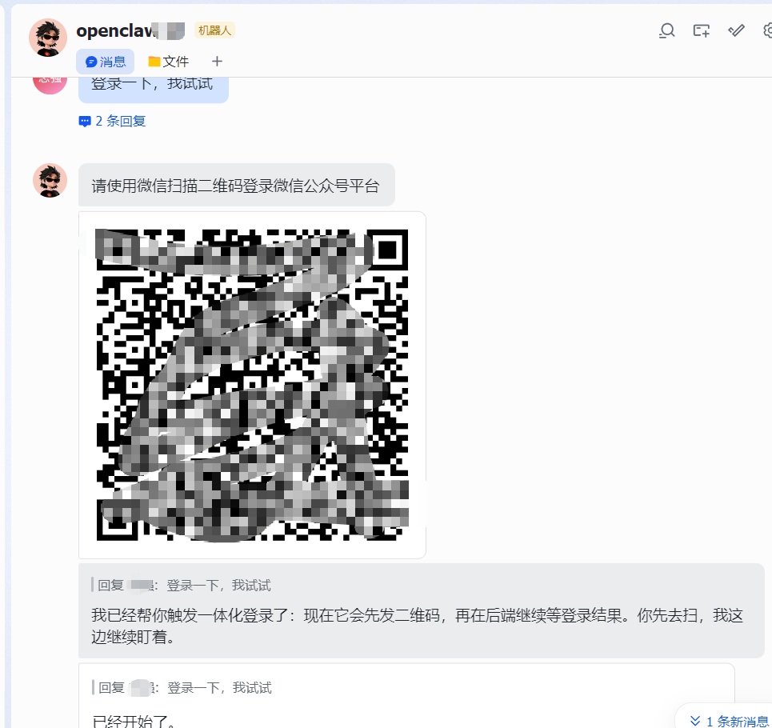
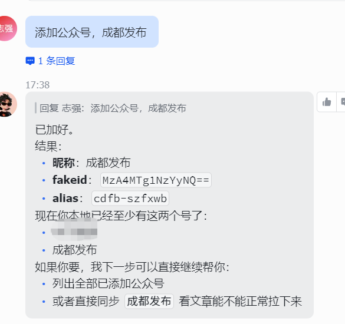
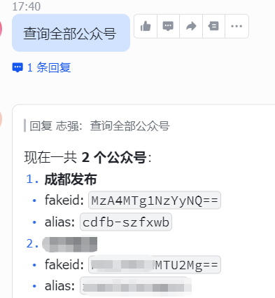
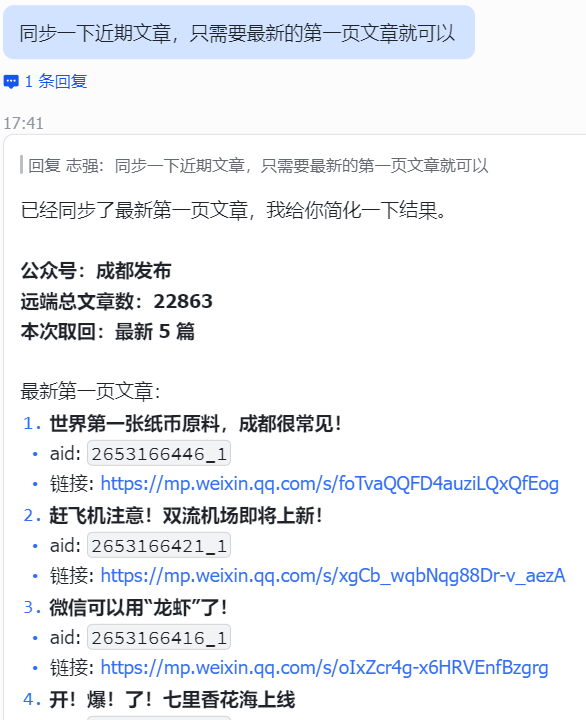
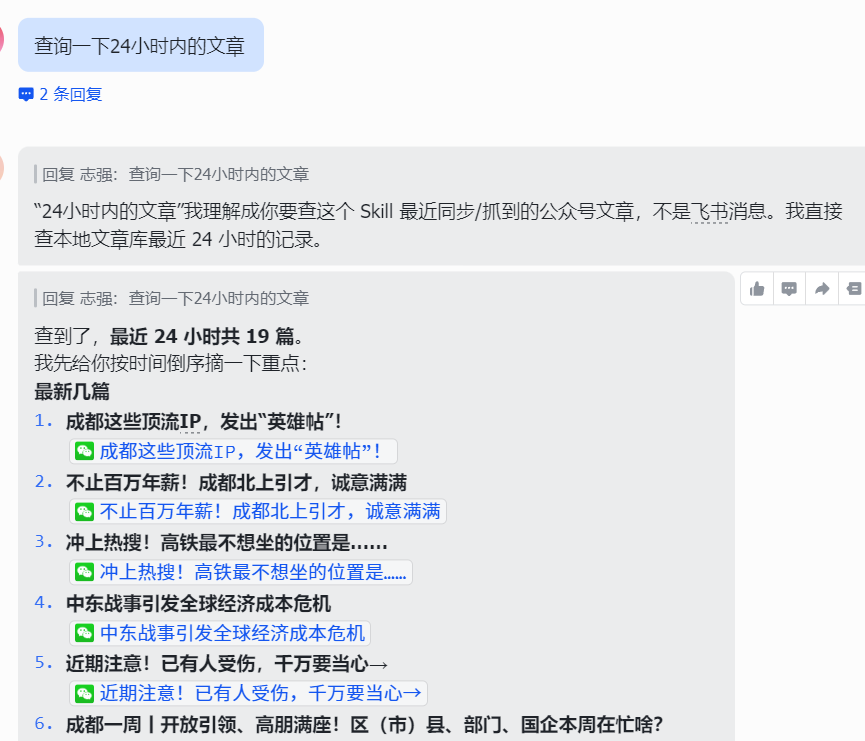
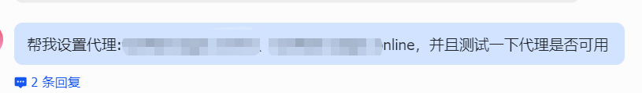
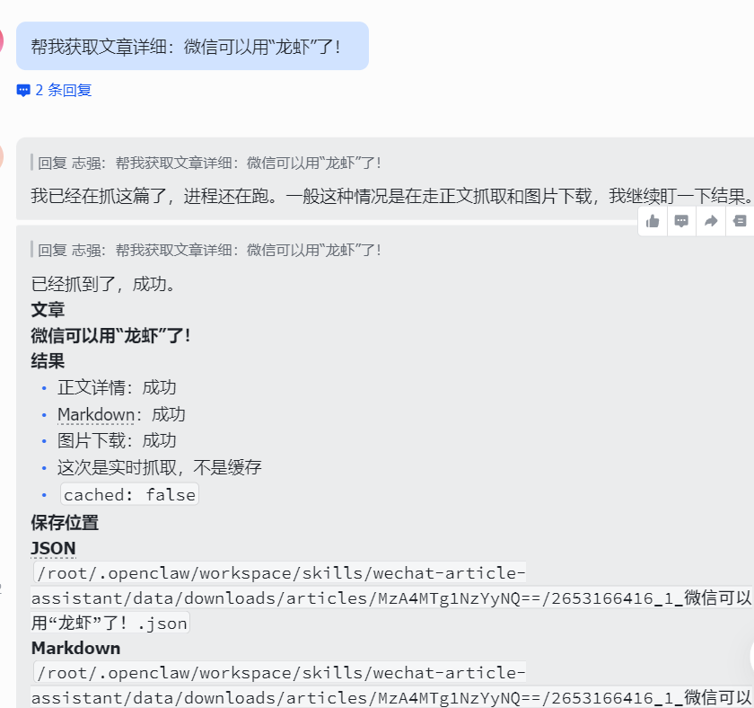
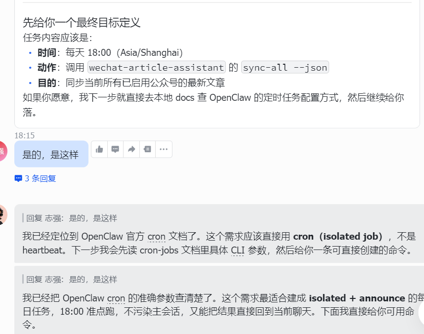
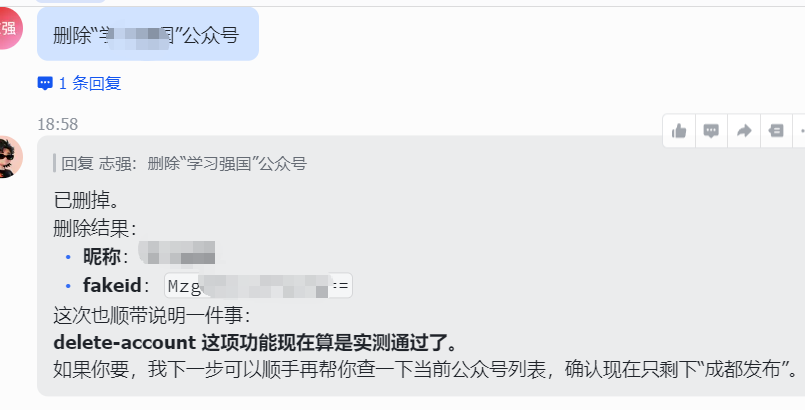

# WeChat Article Assistant

多个微信公众号文章同步和下载助手。

这个 Skill 让 OpenClaw 直接通过本地 Python 脚本完成微信公众号相关操作，不再依赖单独部署的 Web 服务。它适合放在 OpenClaw 工作流里，用来统一管理：

- 公众号登录
- 公众号搜索与添加
- 文章列表同步
- 单篇文章详情抓取
- Markdown / JSON 导出
- 定时同步任务

---

## 适用场景

当你希望在 OpenClaw 中完成下面这些事时，可以使用这个 Skill：

- 登录微信公众号后台并保存登录态
- 搜索并添加要跟踪的公众号
- 同步公众号最新文章到本地 SQLite
- 查看某个公众号最近发布的文章
- 抓取某篇公众号文章的正文、图片和 Markdown
- 为全部公众号配置每天自动同步任务

---

## 操作示例

重要：本节截图用于公开展示 Skill 的实际效果，属于发布内容的一部分，不要在后续精简 README 或清理资源时优化掉。

### 登录



### 搜索与添加公众号



### 查看本地公众号列表



### 同步公众号文章



### 查询最新文章清单



### 配置代理

主要是为了防止被微信封禁。



### 抓取单篇文章详情



### 定时同步任务



### 删除公众号



---

## 主要功能

### 1. 登录微信公众号
- 生成二维码
- 发送二维码到当前聊天会话
- 扫码登录后自动保存 token / cookie
- 支持一体化等待登录完成并自动通知

### 2. 搜索与添加公众号
- 按关键词搜索公众号
- 自动添加唯一匹配公众号
- 根据文章链接反查公众号
- 根据文章链接自动添加公众号
- 查看本地公众号列表
- 删除公众号及其本地文章数据

### 3. 同步公众号文章
- 同步单个公众号
- 同步全部启用的公众号
- 支持不同公众号之间设置同步间隔，降低频控风险
- 支持 OpenClaw cron 定时调用

### 4. 查询文章清单
- 拉取远端最新文章列表
- 查看本地已同步文章
- 支持按公众号查看文章清单

### 5. 抓取单篇文章详情
- 按文章链接抓取正文
- 自动下载图片到本地
- 导出 `article.json`
- 导出 `article.md`
- 可选保存 HTML

---

## 目录结构

```text
wechat-article-assistant/
├── SKILL.md
├── README.md
├── requirements.txt
├── scripts/
│   ├── wechat_article_assistant.py
│   ├── run_sync_all.sh
│   └── ...
├── references/
├── images/
└── agents/
```

---

## 安装依赖

在 Skill 目录下安装 Python 依赖：

```bash
pip install -r requirements.txt
```

---

## 主入口

所有核心操作统一走：

```bash
python scripts/wechat_article_assistant.py --help
```

---

# 主流程：从 0 到可用

## 第一步：登录微信公众号

推荐使用一体化登录方式：

```bash
python scripts/wechat_article_assistant.py login-start \
  --channel feishu \
  --target user:YOUR_OPEN_ID \
  --account default \
  --wait true \
  --json
```

这条命令会：

1. 生成登录二维码
2. 把二维码发到当前聊天会话
3. 后端继续等待扫码结果
4. 登录成功后自动通知
5. 保存登录态到本地 SQLite

---

## 第二步：搜索并添加公众号

### 按关键词搜索

```bash
python scripts/wechat_article_assistant.py search-account "成都发布" --json
```

### 按关键词直接添加

```bash
python scripts/wechat_article_assistant.py add-account-by-keyword "成都发布" --json
```

### 查看当前公众号列表

```bash
python scripts/wechat_article_assistant.py list-accounts --json
```

---

## 第三步：查看公众号最新文章

```bash
python scripts/wechat_article_assistant.py list-account-articles \
  --fakeid "MzA4MTg1NzYyNQ==" \
  --remote true \
  --count 10 \
  --json
```

适合先确认：

- 登录态是否正常
- 远端文章列表是否能拉取
- fakeid 是否正确

---

## 第四步：抓取文章详情

按文章链接抓取：

```bash
python scripts/wechat_article_assistant.py article-detail \
  --link "https://mp.weixin.qq.com/s/xxxxxxxx" \
  --download-images true \
  --include-html false \
  --json
```

执行后通常会得到：

- 文章正文
- 图片下载结果
- `article.json`
- `article.md`

如果你主要是做内容归档或后续转发，这一步最关键。

---

## 第五步：同步公众号文章

### 同步单个公众号

```bash
python scripts/wechat_article_assistant.py sync --fakeid "MzA4MTg1NzYyNQ==" --json
```

### 同步全部启用公众号

```bash
python scripts/wechat_article_assistant.py sync-all --json
```

如果公众号较多，建议增加间隔，降低频控风险：

```bash
python scripts/wechat_article_assistant.py sync-all --interval-seconds 180 --json
```

---

# 定时任务（推荐）

如果你想让 OpenClaw 每天自动同步一次全部公众号，推荐使用固定脚本入口：

```bash
bash ${HOME}/.openclaw/ws-xhs/skills/wechat-article-assistant/scripts/run_sync_all.sh
```

这个脚本默认会调用：

```bash
python scripts/wechat_article_assistant.py sync-all --interval-seconds 180 --json
```

也就是：
- 同步全部启用公众号
- 不同公众号之间默认间隔 180 秒（3 分钟）

适合被 OpenClaw cron 或系统计划任务长期调用。

---

# 额外管理操作

## 查看当前登录状态

```bash
python scripts/wechat_article_assistant.py login-info --validate true --json
```

## 导入旧登录态

```bash
python scripts/wechat_article_assistant.py login-import --file path/to/cookie.json --validate true --json
```

## 清空当前登录态

```bash
python scripts/wechat_article_assistant.py login-clear --json
```

## 删除公众号

```bash
python scripts/wechat_article_assistant.py delete-account --nickname "成都发布" --json
```

## 查看同步日志

```bash
python scripts/wechat_article_assistant.py sync-logs --limit 20 --json
```

## 查看最近文章

```bash
python scripts/wechat_article_assistant.py recent-articles --hours 24 --limit 20 --json
```

---

# 数据说明

本 Skill 会把数据保存在本地，默认根目录为：

```text
~/.openclaw/media/wechat-article-assistant/
```

如需覆盖，可设置：

- `WECHAT_ARTICLE_ASSISTANT_HOME`
- `WECHAT_ARTICLE_OPENCLAW_HOME`（兼容旧命名）

根目录下通常包括：

- `app.db`
- `downloads/articles/`
- `downloads/images/`
- `qrcodes/`
- `logs/wechat_article_assistant.log`

常见导出内容：

- `article.json`
- `article.md`
- 本地图片目录

---

# 使用建议

## 推荐工作方式

最顺的日常流程通常是：

1. 登录公众号后台
2. 添加要关注的公众号
3. 先看远端文章列表
4. 再抓具体文章详情
5. 最后配置定时同步

## 关于频控

当你连续同步多个公众号时，微信后台可能会出现频控。
因此推荐：

- 批量同步时使用 `--interval-seconds`
- 定时任务默认用 `run_sync_all.sh`

---

# 快速命令清单

## 登录

```bash
python scripts/wechat_article_assistant.py login-start --channel feishu --target user:YOUR_OPEN_ID --account default --wait true --json
```

## 添加公众号

```bash
python scripts/wechat_article_assistant.py add-account-by-keyword "成都发布" --json
```

## 列公众号

```bash
python scripts/wechat_article_assistant.py list-accounts --json
```

## 拉文章列表

```bash
python scripts/wechat_article_assistant.py list-account-articles --fakeid "MzA4MTg1NzYyNQ==" --remote true --count 10 --json
```

## 抓文章详情

```bash
python scripts/wechat_article_assistant.py article-detail --link "https://mp.weixin.qq.com/s/xxxxxxxx" --json
```

## 同步单个公众号

```bash
python scripts/wechat_article_assistant.py sync --fakeid "MzA4MTg1NzYyNQ==" --json
```

## 同步全部公众号（带间隔）

```bash
python scripts/wechat_article_assistant.py sync-all --interval-seconds 180 --json
```

---

# 面向公开使用的说明

这个 README 主要面向“怎么用”。

如果你要了解更细的接口定义、参数说明、实现细节，请继续查看：

- `SKILL.md`
- `references/interface-reference.md`
- `references/design.md`

---

如果你是把这个 Skill 公开给别人使用，建议优先让用户先学会这 4 件事：

1. 登录
2. 添加公众号
3. 拉文章列表
4. 抓单篇文章详情

这样上手最快。
